## Tugas Praktikum 11 **(PHP Framework/CI)**

### 1. Langkah awal `konfigurasi pada webserver untuk CI`
#### Buka ***XAMPP Control Panel*** dan lakukan sesuai dengan instruksi pada gambar..!!
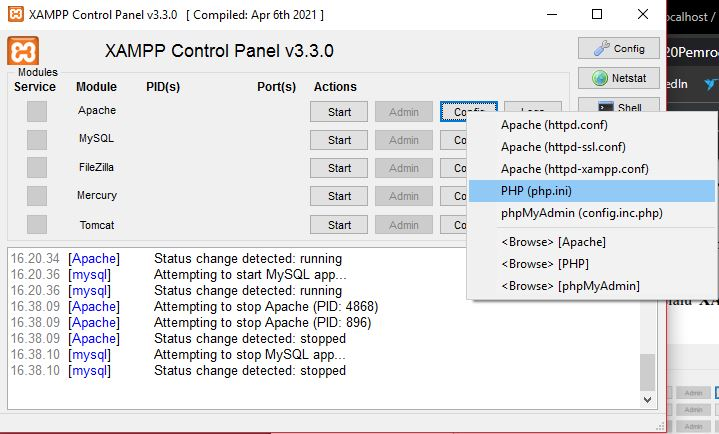


#### Setelah itu aktifkan beberapa pada bagian **extension**..!!
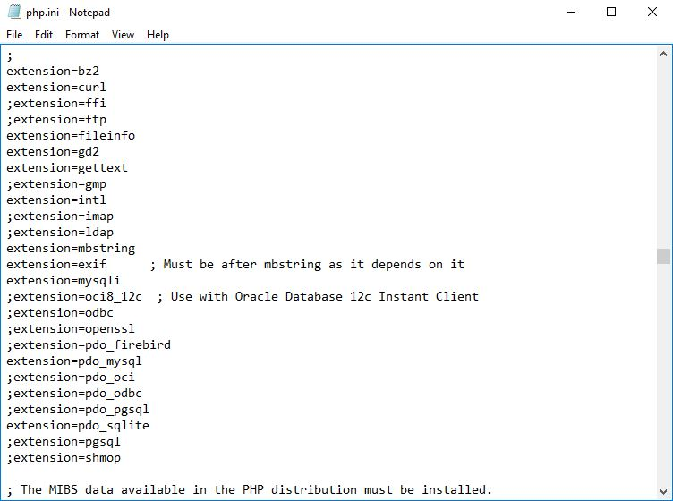


#### Kemudian install CI4 **(CodeIgniter 4)** di website https://codeigniter.com/download, setelah itu buka browser **Localhost**-nya. Dan liat hasilnya..!!
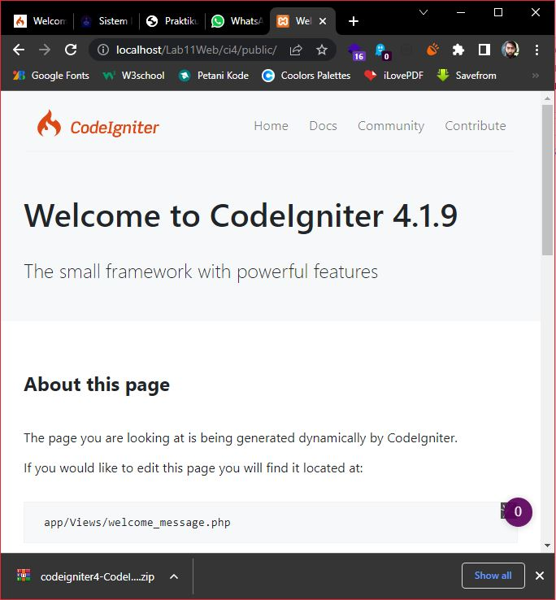


#### sekarang menjalankan CLI **(Command Line Interface)**, lakukan seperti instruksi pada gambar..!!
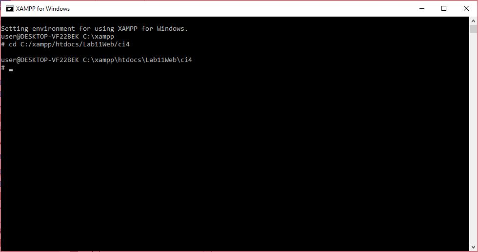


#### Setelah itu lakukan perintah `php spark` untuk memanggil CLI
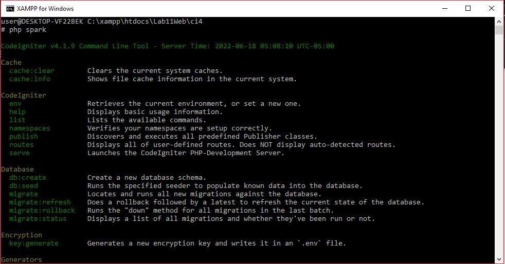


#### Kemudian mengaktifakn mode Debugging untuk menampilkan pesan **"error"**, secara default fitur ini belum aktif. Ketika **"error"** maka akan menampilkan seperti ini:
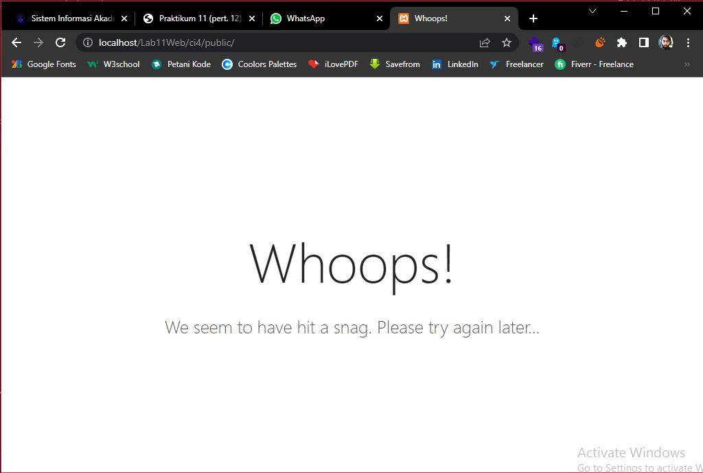


#### Semua jenis **"error"** akan ditampilkan sama. Maka dari itu perlu diaktifkan mode Debugging untuk memudahkan mengetahui pesan **"error"**.
#### Ubah nama file `env` menjadi `.env`, dan ubah juga **nilai konfig-nya** pada enviroment var `CI_ENVIRINMENT` menjadi `development`.
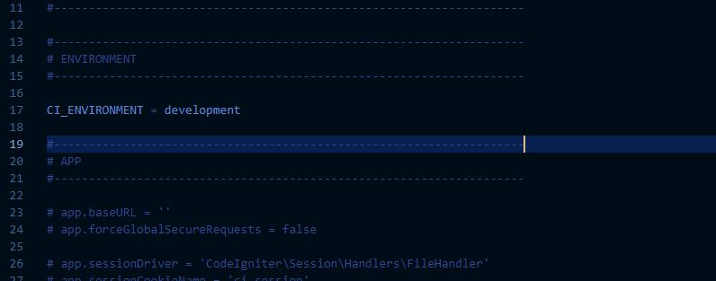


#### Dan hasilnya..!!
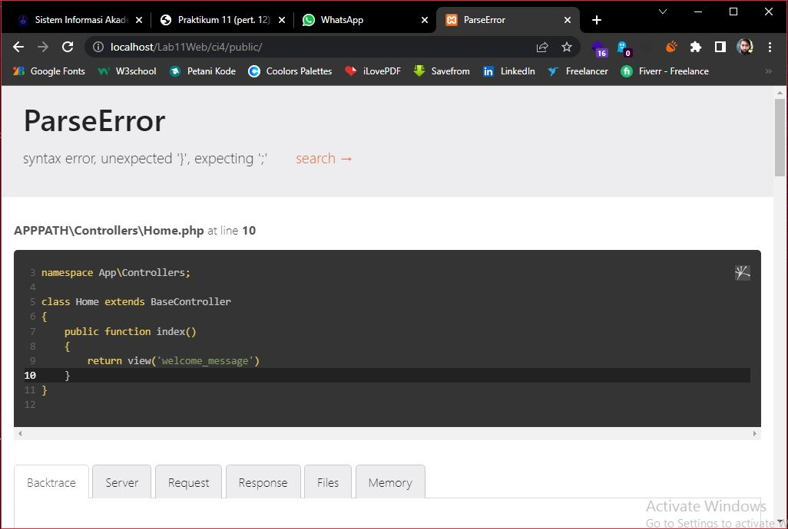


#### Error tersebut terjadi karena kurangnya tanda `;` pada syntax `return` **(Hanya Contoh..!!)**
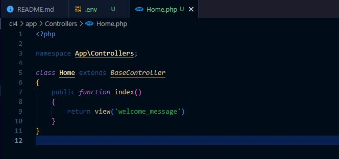

#

### 2. Membuat Route baru
#### tambahkan kode berikut di dalam `routes.php`
```php
$routes->get('/about', 'Page::about');
$routes->get('/contact', 'Page::contact');
$routes->get('/faqs', 'Page::faqs');
```
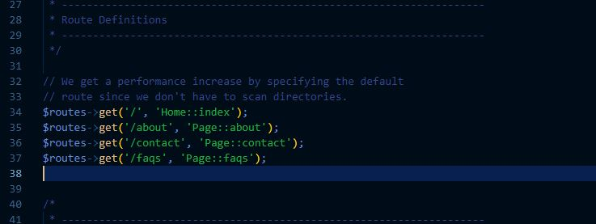

#### untuk mengetahui Route yang ditambahkan sudah benar, buka CLI dan lakukan perintah `php spark routes`..!!
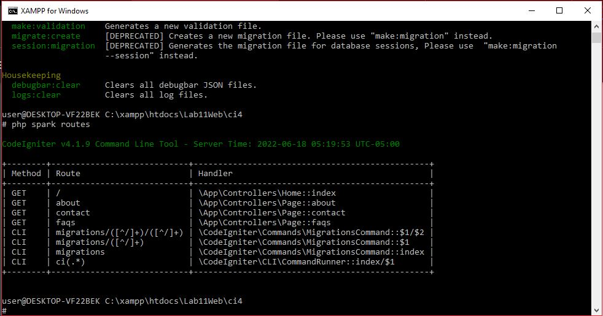

#### Dan lihat hasilnya..!!
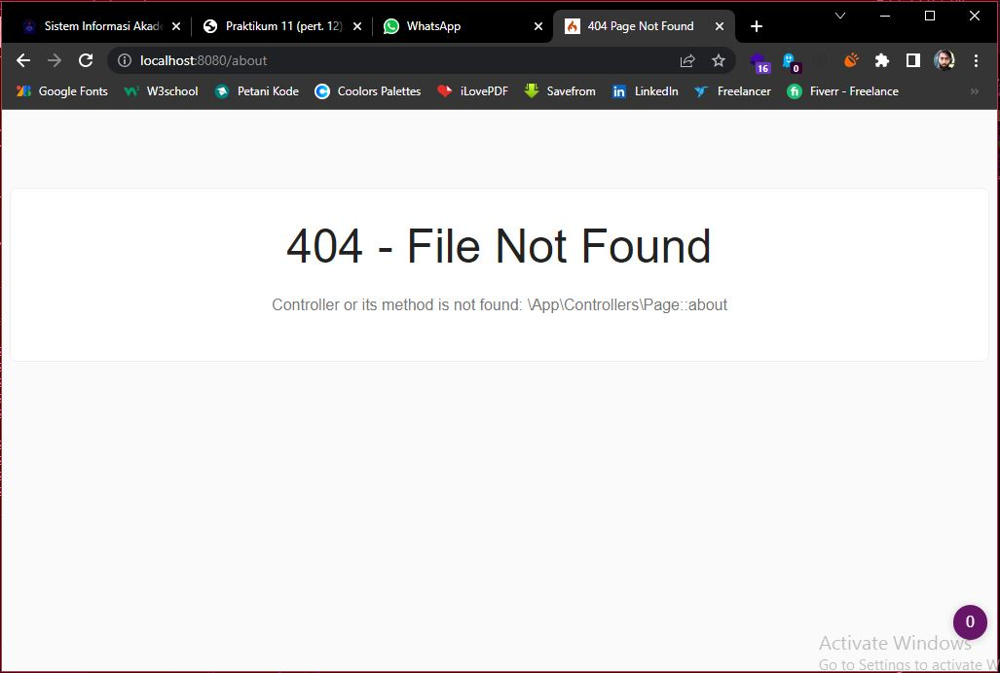
### Halaman menampilan tulisan **404 - File Not Found** karena file/page tersebut kosong atau tidak ada isinya.

#

### 3. Membuat Controller
#### Selanjutnya membuat controller, buat file baru dengan nama `page.php` pada direktori **Controller**.
#### kemudian isi kodenya dengan:
```php
<?php
namespace App\Controllers;

class Page extends BaseController
{
    public function about() {
        echo "Ini halaman About";
    }
    public function contact() {
        echo "Ini halaman Contact";
    }
    public function faqs() {
        echo "Ini halaman FAQ";
    }
}
```

#### Setelah itu liat hasil pada salah satu halamannya..!!
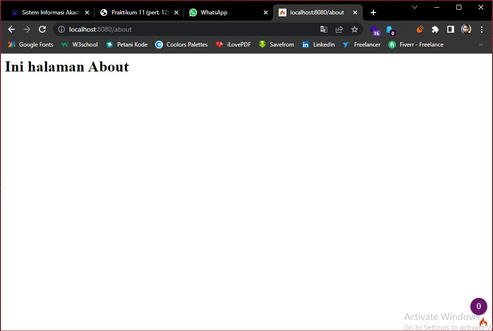

#

### 4. Mengubah status `autoroute`
#### Secara default fitur autoroute pada Codeiginiter sudah aktif. Untuk mengubah status autoroute dapat mengubah nilai variabelnya. Untuk menonaktifkan ubah nilai **true** menjadi **false**.
```php
$routes->setAutoroute(true);
```

#### Dan tambahkan method baru pada **Controller Page** seperti berikut:
```php
public function tos()
{
    echo "ini halaman Term of Services";
}
```

#### Dan hasilnya:
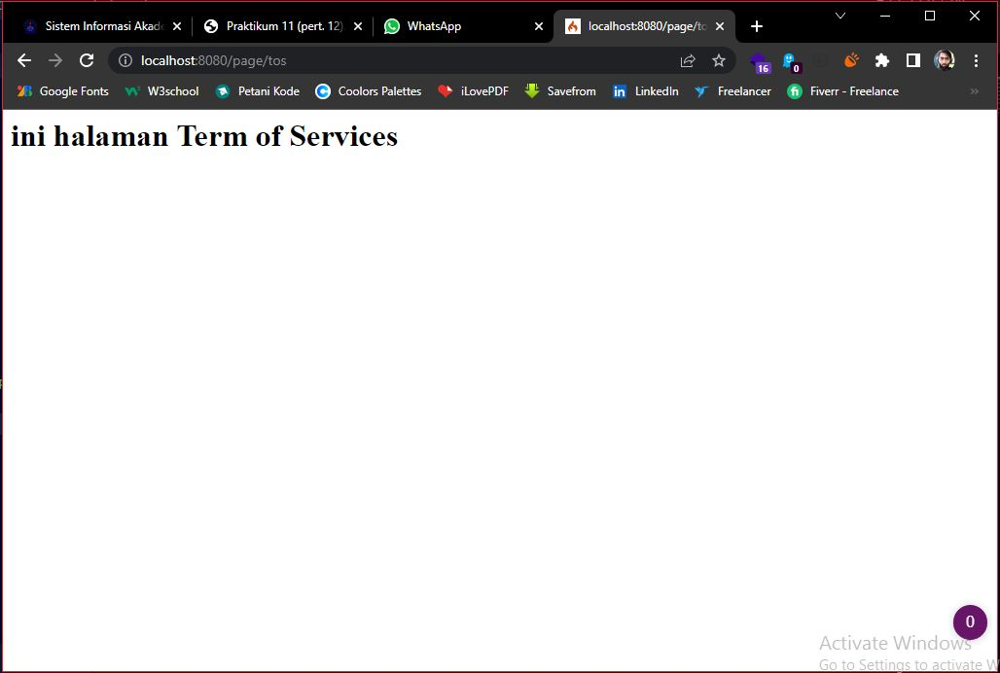

#

### 5. Membuat View
#### Selanjutya membuat tampilan view untuk tampilan Web kita. Buat file baru dengan nama `about.php` pada **(app/view/[buat di sini!])**.
#### Kemudian isi dengan kode seperti ini..!!
```html
<!DOCTYPE html>
<html lang="en">
<head>
    <meta charset="UTF-8">
    <title><?= $title; ?></title>
</head>
<body>
    <h1><?= $title; ?></h1>
    <hr>
    <p><?= $content; ?></p>
</body>
</html>
```

#### Ubah **method about** pada class **Controller Page** menjadi seperti ini..!!
```php
public function about()
{
    return view('about', [
    'title' => 'Halaman Abot',
    'content' => 'Ini adalah halaman abaut yang menjelaskan tentang isi halaman ini.'
    ]);
}
```

#### Dan refresh halaman tersebut..!!
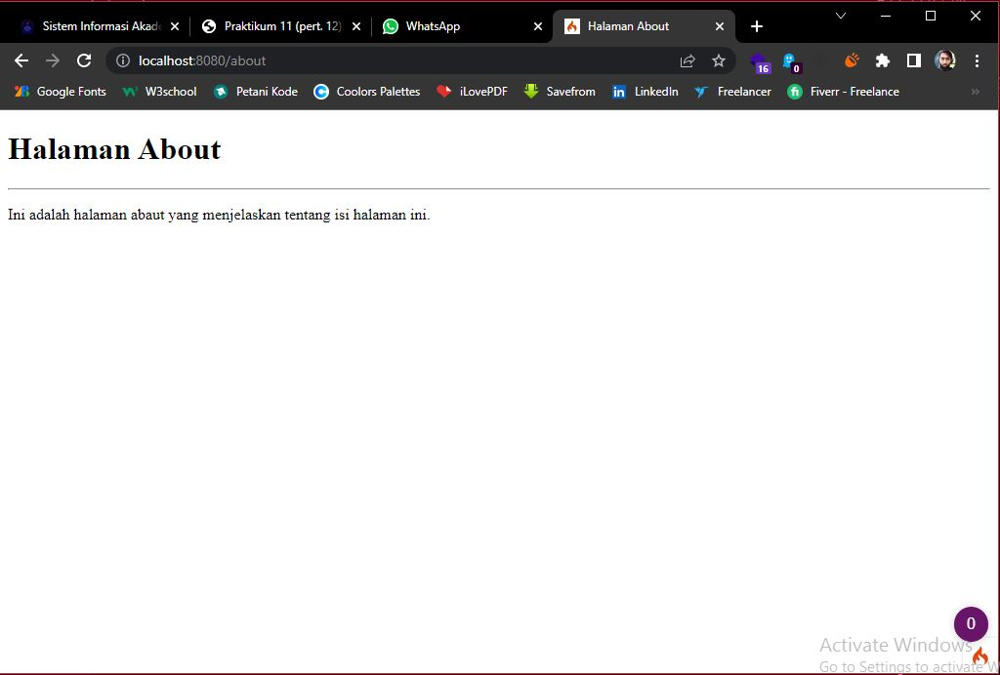

#

### 6. Membuat Layout Web dengan `CSS`
#### buat file CSS pada direktori **public** dengan nama `style.css`

#### Kemudian buat folder **template** pada direktori **view**, kemudian buat file **header.php** dan **footer.php**.

#### File **app/view/template/header.php**
```html
<!DOCTYPE html>
<html lang="en">
<head>
    <meta charset="UTF-8">
    <title><?= $title; ?></title>
    <link rel="stylesheet" href="<?= base_url('/style.css');?>">
</head>
<body>
    <div id="container">
    <header>
        <h1>Layout Sederhana</h1>
    </header>
    <nav>
        <a href="<?= base_url('/');?>" class="active">Home</a>
        <a href="<?= base_url('/artikel');?>">Artikel</a>
        <a href="<?= base_url('/about');?>">About</a>
        <a href="<?= base_url('/contact');?>">Kontak</a>
    </nav>
    <section id="wrapper">
        <section id="main">
```

#### File **app/view/template/footer.php**
```html
    </section>
    <aside id="sidebar">
        <div class="widget-box">
            <h3 class="title">Widget Header</h3>
            <ul>
                <li><a href="#">Widget Link</a></li>
                <li><a href="#">Widget Link</a></li>
            </ul>
            </div>
            <div class="widget-box">
                <h3 class="title">Widget Text</h3>
                <p>Vestibulum lorem elit, iaculis in nisl volutpat, malesuada tincidunt arcu. Proin in leo fringilla, vestibulum mi porta, faucibus felis Integer pharetra est nunc, nec pretium nunc pretium ac.</p>
            </div>
        </aside>
    </section>
    <footer>
        <p>&copy; 2021 - Universitas Pelita Bangsa</p>
    </footer>
    </div>
</body>
</html>
```

#### Kemudian ubah file **app/view/template/about.php** menjadi seperti ini..!!
```php
<?= $this->include('template/header'); ?>

<h1><?= $title; ?></h1>
<hr>
<p><?= $content; ?></p>

<?= $this->include('template/footer'); ?>
```

#### Selanjutnya refresh tampilan pada alamat http://localhost:8080/about
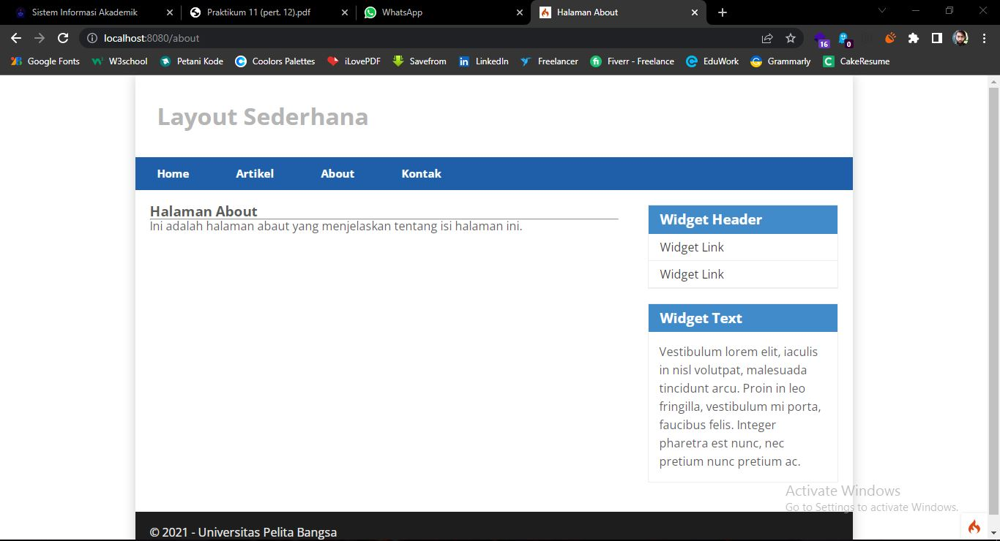