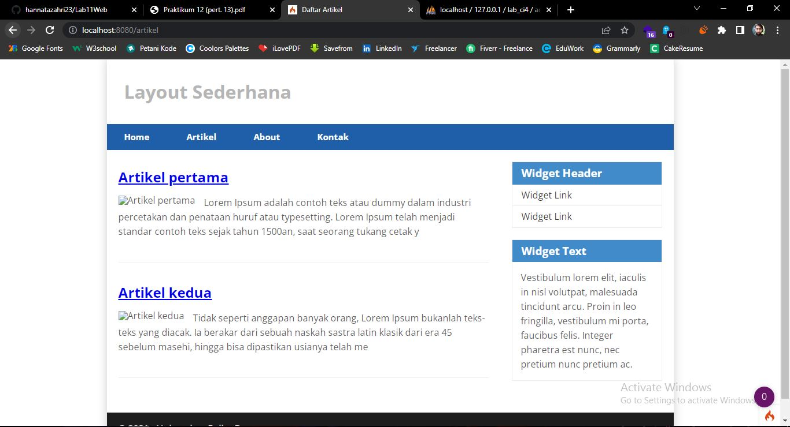

## Tugas Praktikum 11 **(PHP Framework/CI)**

### 1. Langkah awal `konfigurasi pada webserver untuk CI`
#### Buka ***XAMPP Control Panel*** dan lakukan sesuai dengan instruksi pada gambar..!!


#### Setelah itu aktifkan beberapa pada bagian **extension**..!!


#### Kemudian install CI4 **(CodeIgniter 4)** di website https://codeigniter.com/download, setelah itu buka browser **Localhost**-nya. Dan liat hasilnya..!!


#### sekarang menjalankan CLI **(Command Line Interface)**, lakukan seperti instruksi pada gambar..!!


#### Setelah itu lakukan perintah `php spark` untuk memanggil CLI


#### Kemudian mengaktifakn mode Debugging untuk menampilkan pesan **"error"**, secara default fitur ini belum aktif. Ketika **"error"** maka akan menampilkan seperti ini:


#### Semua jenis **"error"** akan ditampilkan sama. Maka dari itu perlu diaktifkan mode Debugging untuk memudahkan mengetahui pesan **"error"**.
#### Ubah nama file `env` menjadi `.env`, dan ubah juga **nilai konfig-nya** pada enviroment var `CI_ENVIRINMENT` menjadi `development`.


#### Dan hasilnya..!!


#### Error tersebut terjadi karena kurangnya tanda `;` pada syntax `return` **(Hanya Contoh..!!)**


#

### 2. Membuat Route baru
#### tambahkan kode berikut di dalam `routes.php`
```php
$routes->get('/about', 'Page::about');
$routes->get('/contact', 'Page::contact');
$routes->get('/faqs', 'Page::faqs');
```


#### untuk mengetahui Route yang ditambahkan sudah benar, buka CLI dan lakukan perintah `php spark routes`..!!


#### Dan lihat hasilnya..!!

#### Halaman menampilan tulisan **404 - File Not Found** karena file/page tersebut kosong atau tidak ada isinya.

#

### 3. Membuat Controller
#### Selanjutnya membuat controller, buat file baru dengan nama `page.php` pada direktori **Controller**.
#### kemudian isi kodenya dengan:
```php
<?php
namespace App\Controllers;

class Page extends BaseController
{
    public function about() {
        echo "Ini halaman About";
    }
    public function contact() {
        echo "Ini halaman Contact";
    }
    public function faqs() {
        echo "Ini halaman FAQ";
    }
}
```

#### Setelah itu liat hasil pada salah satu halamannya..!!


#

### 4. Mengubah status `autoroute`
#### Secara default fitur autoroute pada Codeiginiter sudah aktif. Untuk mengubah status autoroute dapat mengubah nilai variabelnya. Untuk menonaktifkan ubah nilai **true** menjadi **false**.
```php
$routes->setAutoroute(true);
```

#### Dan tambahkan method baru pada **Controller Page** seperti berikut:
```php
public function tos()
{
    echo "ini halaman Term of Services";
}
```

#### Dan hasilnya:


#

### 5. Membuat View
#### Selanjutya membuat tampilan view untuk tampilan Web kita. Buat file baru dengan nama `about.php` pada **(app/view/[buat di sini!])**.
#### Kemudian isi dengan kode seperti ini..!!
```html
<!DOCTYPE html>
<html lang="en">
<head>
    <meta charset="UTF-8">
    <title><?= $title; ?></title>
</head>
<body>
    <h1><?= $title; ?></h1>
    <hr>
    <p><?= $content; ?></p>
</body>
</html>
```

#### Ubah **method about** pada class **Controller Page** menjadi seperti ini..!!
```php
public function about()
{
    return view('about', [
    'title' => 'Halaman Abot',
    'content' => 'Ini adalah halaman abaut yang menjelaskan tentang isi halaman ini.'
    ]);
}
```

#### Dan refresh halaman tersebut..!!


#

### 6. Membuat Layout Web dengan `CSS`
#### buat file CSS pada direktori **public** dengan nama `style.css`

#### Kemudian buat folder **template** pada direktori **view**, kemudian buat file **header.php** dan **footer.php**.

#### File **app/view/template/header.php**
```html
<!DOCTYPE html>
<html lang="en">
<head>
    <meta charset="UTF-8">
    <title><?= $title; ?></title>
    <link rel="stylesheet" href="<?= base_url('/style.css');?>">
</head>
<body>
    <div id="container">
    <header>
        <h1>Layout Sederhana</h1>
    </header>
    <nav>
        <a href="<?= base_url('/');?>" class="active">Home</a>
        <a href="<?= base_url('/artikel');?>">Artikel</a>
        <a href="<?= base_url('/about');?>">About</a>
        <a href="<?= base_url('/contact');?>">Kontak</a>
    </nav>
    <section id="wrapper">
        <section id="main">
```

#### File **app/view/template/footer.php**
```html
    </section>
    <aside id="sidebar">
        <div class="widget-box">
            <h3 class="title">Widget Header</h3>
            <ul>
                <li><a href="#">Widget Link</a></li>
                <li><a href="#">Widget Link</a></li>
            </ul>
            </div>
            <div class="widget-box">
                <h3 class="title">Widget Text</h3>
                <p>Vestibulum lorem elit, iaculis in nisl volutpat, malesuada tincidunt arcu. Proin in leo fringilla, vestibulum mi porta, faucibus felis Integer pharetra est nunc, nec pretium nunc pretium ac.</p>
            </div>
        </aside>
    </section>
    <footer>
        <p>&copy; 2021 - Universitas Pelita Bangsa</p>
    </footer>
    </div>
</body>
</html>
```

#### Kemudian ubah file **app/view/template/about.php** menjadi seperti ini..!!
```php
<?= $this->include('template/header'); ?>

<h1><?= $title; ?></h1>
<hr>
<p><?= $content; ?></p>

<?= $this->include('template/footer'); ?>
```

#### Selanjutnya refresh tampilan pada alamat http://localhost:8080/about


#


## Tugas Praktikum 12 **(Framework Lanjutan : CRUD)**

### 1.) Membuat Database
#### Langkah pertama membuat Database dengan nama `lab_ci4`
```sql
CREATE DATABASE Lab_ci4;
```
#### Kemudian membuat table baru dengan nama `artikel`
```sql
CREATE TABLE artikel {
    id INT(11) auto_increment,
    judul VARCHAR(200) NOT NULL,
    isi TEXT,
    gambar VARCHAR(200),
    status TINYINT(1) DEFAULT 0,
    slug VARCHAR(200),
    PRIMARY KEY(id)
}
```

#

### 2.) Konfigurasi koneksi DB
#### Selanjutnya membuat konfigurasi untuk menghubungkan dengan database server.  Pada praktikum ini kita gunakan konfigurasi pada file **.env**.


#

### 3.) Membuat Model
#### Selanjutnya membuat Model untuk memproses data Artikel. Buat file baru di direktori (folder) `app/Models` dengan nama **ArtikelModel.php**.
```php
<?php
namespace App\Models;

use CodeIgniter\Model;

class ArtikelModel extends Model
{
    protected $table = 'artikel';
    protected $primaryKey = 'id';
    protected $useAutoIncrement = true;
    protected $allowedFields = ['judul', 'isi', 'status', 'slug', 'gambar'];
}
```

#

### 4.) Membuat Controller
#### Buat Controller baru dengan nama **Artikel.php** pada direktori `app/Controllers`.
```php
<?php
namespace App\Controllers;

use App\Models\ArtikelModel;

class Artikel extends BaseController {
    public function index() {
        $title = 'Daftar Artikel';
        $model = new ArtikelModel();
        $artikel = $model->findAll();
        return view('artikel/index', compact('artikel', 'title'));
    }
}
```

#

### 5.) Membuat View
#### Buatlah direktori baru dengan nama **artikel** pada direktori `app/views`, setelah itu buatlah file baru di dalamnya dengan nama **index.php**
```php
<?= $this->include('template/header'); ?>

<?php if($artikel): foreach($artikel as $row): ?>
    <article class="entry">
        <h2><a href="<?= base_url('/artikel/' . $row['slug']);?>"><?= $row['judul']; ?></a></h2>
        " alt="<?= $row['judul']; ?>">
        <p><?= substr($row['isi'], 0, 200); ?></p>
    </article>
    <hr class="divider" />
<?php endforeach; else: ?>
<article class="entry">
    <h2>Belum ada data.</h2>
</article>
<?php endif; ?>

<?= $this->include('template/footer'); ?>
```

#### Selanjutnya buka browser dan akses url: http://localhost:8080/artikel dan lihat hasilnya..!!


#### Karena belum ada data yang ditampilkan, cobalah menambahkan beberapa data pada DB agar halamannya dapat menampilkan sesuatu.
```sql
INSERT INTO artikel (judul, isi, slug) VALUE
('Artikel pertama', 'Lorem Ipsum adalah contoh teks atau dummy dalam industri percetakan dan penataan huruf atau typesetting. Lorem Ipsum telah menjadi standar contoh teks sejak tahun 1500an, saat seorang tukang cetak yang tidak dikenal mengambil sebuah kumpulan teks dan mengacaknya untuk menjadi sebuah buku contoh huruf.', 'artikel-pertama'),
('Artikel kedua', 'Tidak seperti anggapan banyak orang, Lorem Ipsum bukanlah teks-teks yang diacak. Ia berakar dari sebuah naskah sastra latin klasik dari era 45 sebelum masehi, hingga bisa dipastikan usianya telah mencapai lebih dari 2000 tahun.', 'artikel-kedua');
```

#### Refresh kembali browsernya dan lihat lagi hasilnya..!!


#

### 6.) Membuat tampilan **Detail** artikel
#### Selanjutnya menampilkan detail artikel / satu judul artikel yang di *klik*. Tambahkan fungsi baru pada **Controller Artikel**.
```php
public function view($slug) {
    $model = new ArtikelModel();
    $artikel = $model->where(['slug' => $slug])->first();

    // Menampilkan error apabila data tidak ada.
    if (!$artikel)
    {
        throw PageNotFoundException::forPageNotFound();
    }

    $title = $artikel['judul'];
    return view('artikel/detail', compact('artikel', 'title'));
}
```

#

### 7.) Membuat view **Detail**
#### Buat view baru untuk halaman detail dengan nama **app/views/artikel/detail.php**.
```php
<?= $this->include('template/header'); ?>

<article class="entry">
    <h2><?= $artikel['judul']; ?></h2>
    " alt="<?= $artikel['judul']; ?>">
    <p><?= $artikel['isi']; ?></p>
</article>

<?= $this->include('template/footer'); ?>
```

#

### 8.) Membuat routing untuk artikel **Detail**
#### Buka Kembali file `app/config/Routes.php`, kemudian tambahkan routing untuk artikel detail.
```php
$routes->get('/artikel/(:any)', 'Artikel::view/$1')
```

#### Dan refresh lagi halaman web-nya, kemudian klik salah satu **link** Artikel..!!


#

### 8.) Membuat menu Admin
#### Buat method baru pada **Controller Artikel** dengan nama **admin_index().**
```php
public function admin_index() {
    $title = 'Daftar Artikel';
    $model = new ArtikelModel();
    $artikel = $model->findAll();
    return view('artikel/admin_index', compact('artikel', 'title'));
}
```

#### Selanjutnya buat view untuk tampilan admin, buatlah file baru pada directori `app/views/Artikel` dengan nama **admin_index.php**.
```html
<?= $this->include('template/admin_header'); ?>
<table class="table">
    <thead>
        <tr>
            <th>ID</th>
            <th>Judul</th>
            <th>Status</th>
            <th>Aksi</th>
        </tr>
        </thead>
    <tbody>
        <?php if($artikel): foreach($artikel as $row): ?>
        <tr>
            <td><?= $row['id']; ?></td>
            <td>
                <b><?= $row['judul']; ?></b>
                <p><small><?= substr($row['isi'], 0, 50); ?></small></p>
            </td>
            <td><?= $row['status']; ?></td>
            <td>
                <a class="btn" href="<?= base_url('/admin/artikel/edit/' .$row['id']);?>">Ubah</a>
                <a class="btn btn-danger" onclick="return confirm('Yakinmenghapus data?');" href="<?=base_url('/admin/artikel/delete/' .$row['id']);?>">Hapus</a>
            </td>
        </tr>
        <?php endforeach; else: ?>
        <tr>
            <td colspan="4">Belum ada data.</td>
        </tr>
        <?php endif; ?>
    </tbody>
    <tfoot>
        <tr>
            <th>ID</th>
            <th>Judul</th>
            <th>Status</th>
            <th>Aksi</th>
        </tr>
    </tfoot>
</table>
<?= $this->include('template/admin_footer'); ?>
```

#### Kemudian tambahkan routing untuk menu admin di `app/Config/Routes.php`.
```php
$routes->group('admin', function($routes) {
    $routes->get('artikel', 'Artikel::admin_index');
    $routes->add('artikel/add', 'Artikel::add');
    $routes->add('artikel/edit/(:any)', 'Artikel::edit/$1');
    $routes->get('artikel/delete/(:any)', 'Artikel::delete/$1');
});
```

#### Akses menu admin dengan url: http://localhost:8080/admin/artikel, dan lihat hasilnya..!!


#

### 9.) Menambahkan data artikel
#### Tambahkan fungsi/method baru pada **Controller Artikel** dengan nama **add()**.
```php
public function add() {
    // validasi data.
    $validation = \Config\Services::validation();
    $validation->setRules(['judul' => 'required']);
    $isDataValid = $validation->withRequest($this->request)->run();

    if ($isDataValid) {
        $artikel = new ArtikelModel();
        $artikel->insert([
            'judul' => $this->request->getPost('judul'),
            'isi' => $this->request->getPost('isi'),
            'slug' => url_title($this->request->getPost('judul')),]);
        return redirect('admin/artikel');
    }
        $title = "Tambah Artikel";
        return view('artikel/form_add', compact('title'));
}
```

#### Kemudian buat file baru pada directory `app/Views/Artikel` untuk form tambah dengan nama **form_add.php**
```php
<?= $this->include('template/admin_header'); ?>

<h2><?= $title; ?></h2>
<form action="" method="post">
    <p>
        <input type="text" name="judul">
    </p>
    <p>
        <textarea name="isi" cols="50" rows="10"></textarea>
    </p>
    <p><input type="submit" value="Kirim" class="btn btn-large"></p>
</form>

<?= $this->include('template/admin_footer'); ?>
```

#### pada halaman url: http://localhost:8080/admin/artikel, klik `Tambah Artikel` untuk melihat hasilnya.


#

### 10.) Mengubah Data
#### Tambahkan fungsi/method baru pada **Controller Artikel** dengan nama **edit()**.
```php
public function edit($id) {
    $artikel = new ArtikelModel();
    
    // validasi data.
    $validation = \Config\Services::validation();
    $validation->setRules(['judul' => 'required']);
    $isDataValid = $validation->withRequest($this->request)->run();
    
    if ($isDataValid)
    {
        $artikel->update($id, [
            'judul' => $this->request->getPost('judul'),
            'isi' => $this->request->getPost('isi'),
        ]);
        return redirect('admin/artikel');
    }
    
    // ambil data lama
    $data = $artikel->where('id', $id)->first();
    $title = "Edit Artikel";
    return view('artikel/form_edit', compact('title', 'data'));
}
```

### Kemudian buat file baru pada directory `app/Views/Artikel` untuk form tambah dengan nama **form_edit.php**.
```php
<?= $this->include('template/admin_header'); ?>

<h2><?= $title; ?></h2>
<form action="" method="post">
    <p>
        <input type="text" name="judul" value="<?= $data['judul'];?>" >
    </p>
    <p>
        <textarea name="isi" cols="50" rows="10"><?= $data['isi'];?></textarea>
    </p>
    <p><input type="submit" value="Kirim" class="btn btn-large"></p>
</form>

<?= $this->include('template/admin_footer'); ?>
```

#### pada halaman url: http://localhost:8080/admin/artikel, klik icon `Ubah` untuk melihat hasilnya.


### 11.) Menghapus data
#### Tambahkan fungsi/method baru pada **Controller Artikel** dengan nama **delete().**
```php
public function delete($id) {
    $artikel = new ArtikelModel();
    $artikel->delete($id);
    return redirect('admin/artikel');
}
```
